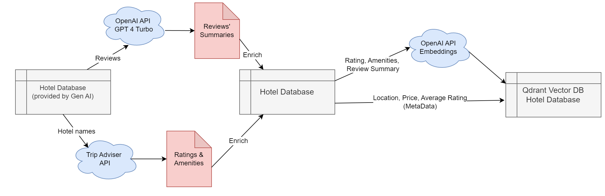
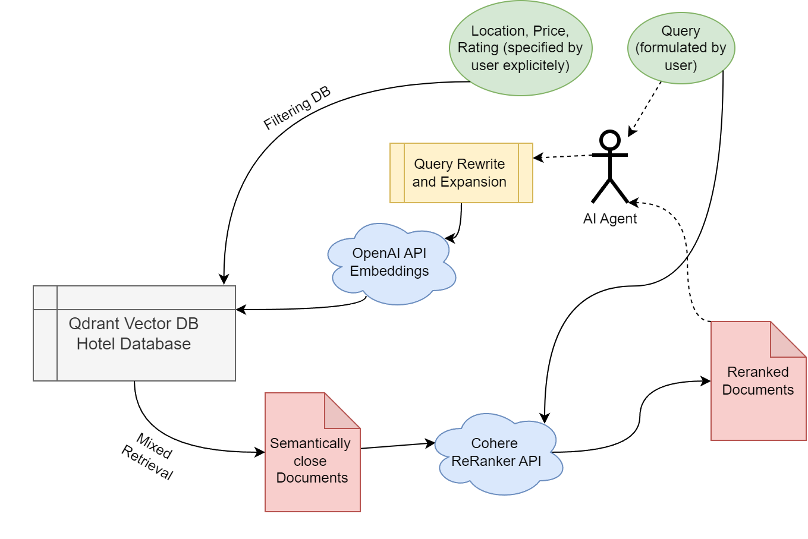
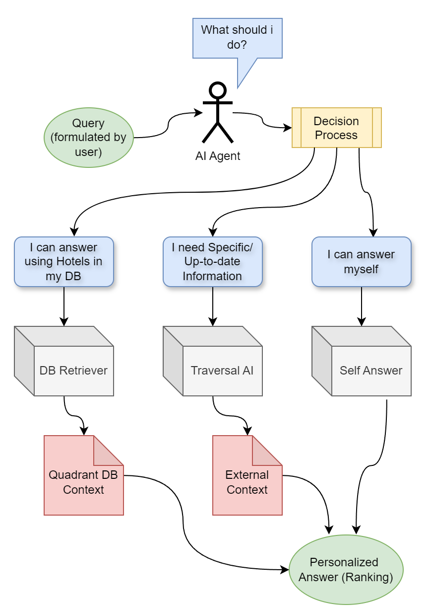

# Voyage.ai
## Hotel Search Assistant

Introducing Voyage.AI, our intelligent AI chatbot (Agent), designed to assist users in discovering the perfect hotels and accessing pertinent information, all through simple text queries and optional search parameters.

At the core of our Agent lies OpenAI GPT 4.0, providing the robust backbone necessary for intelligent interactions. Additionally, we've constructed a vector Qdrant DB housing hotels enriched with TripAdvisor's comprehensive features, ensuring a rich repository of relevant data. To further enhance our offerings, we seamlessly integrate with Traversaal AI, tapping into external sources for additional insights.

Our solution is seamlessly deployed using the Streamlit framework, promising a user-friendly and intuitive experience for all travelers seeking tailored hotel recommendations and information.

## Data Enrichment

Our decision to focus on collecting clean hotel descriptions, along with their ratings and amenities, stems from the recognition that raw reviews may lack consistency and objectivity, often influenced by personal biases.

To curate our dataset, we meticulously sorted positive (rating ≥ 4.0) and negative (rating < 4.0) reviews from the original Hotels dataset. From each category, we selected the top 6 reviews based on length and employed the formidable OpenAI GPT 4.0 to distill their essence, highlighting both strengths and weaknesses mentioned therein.

Expanding our dataset beyond the confines of the Gen AI Hackathon, we leveraged the TripAdvisor API [link](https://tripadvisor-content-api.readme.io/reference/overview) to enrich our data further. This comprehensive integration enabled us to capture a wide array of amenities, ranging from pet-friendly policies to WIFI availability, alongside nuanced rankings across various facets of hotel experience, including location, sleep quality, room conditions, service standards, and cleanliness.

## DB Construction

As a result of our efforts, each unique hotel now boasts its own dedicated document, complete with a comprehensive description. This description encompasses essential metadata such as the city, price range, and average rating, alongside a detailed text section summarizing ratings, amenities, and reviews.

To enable seamless semantic search functionality, we've transformed the textual portion of these descriptions into embeddings utilizing the powerful OpenAI Embedding model (text-embedding-3-large). Additionally, we've established a robust link to the Qdrant vector database [link](https://qdrant.tech/), housing these enriched documents. This setup empowers us to swiftly MixRetrieve hotel documents, filtered by the user's specified criteria of city, price, and rating, while also ranking them based on semantic proximity to the user's query.

  

## Retrieval Results Reranking

The proximity (closeness) of the retrieved documents in most cases is not perfect, especially their ranking. To mitigate this, we employed the Cohere API ReRanker [link](https://txt.cohere.com/rerank/) model (rerank-multilingual-v2.0), which reevaluates the positions in the ranking of the previously retrieved hotels with respect to the user's text query. In addition to the reevaluation, top _k_ (specified by the user)
hotels are taken for further processing.

## External Information

Since the information present in the hotel vector Database is not sufficient to enfold all possible wishes and questions by the user, we integrate our project with Traversal AI [link](https://docs.traversaal.ai/), which using the question-answer API can provide up-to-date information from the internet. Thus we give access to our Agent to the external information storage.

## Agent

At the core of the project, we create an Agent powered by OpenAI GPT 4.0 model and LangChain framework [link](https://www.langchain.com/):

Upon receiving the user's text query, the Agent dynamically determines the appropriate course of action. With each interaction, the Agent faces a pivotal decision: whether to leverage the Hotel Database (Qdrant vector DB) for query-relevant hotels, utilize the Traversal AI API to procure additional information not present in the local database, or provide an answer independently without resorting to external tools.

Facilitating communication in a chat format, the Agent meticulously maintains a comprehensive history of the conversation, including any changes to filter options (metadata) made by the user. Regardless of the information source, the Agent adeptly justifies and tailors its responses to align seamlessly with the user's ongoing requests and preferences.

After Promt Engineering, we store all the selected prompts in the `src/prompts.py` file.

## Adding new data

To add new data to the Qdrant vector database, you need to run the following command:

~~~
python src/create_vector_db.py
~~~

This script will run the whole pipeline of Data Enrichment. It will collect the data from the TripAdvisor API, summarize the reviews, and create the embeddings for the text. Then it will store the data in the Qdrant vector database.

create_vector_db.py has the following parameters:
- `--dataset-path` - the path to the dataset, the dataset can be csv or huggingface dataset
- `--db-path` - the path to the Qdrant vector database
- `--is-hf` - the flag to specify if the dataset is huggingface dataset
- `--collection-name` - the name of the collection in the Qdrant vector database. The default value is `hotels`.

and some other parameters.

if you want to create the new collection of the embeddings, you need to run the following command:

~~~
python src/create_vector_db.py --collection-name=any_name --dataset-path=any_path
~~~

This will create the new collection with the name `any_name` and `any_path` is the path to the dataset.

## P.S.
Developed by [Romit Ganjoo](https://www.linkedin.com/in/romitganjoo98/), romit.ganjoo@sjsu.edu and [Srinivas Rao Chavan](https://www.linkedin.com/in/srinivas1698/), srinivasrao.chavan@sjsu.edu